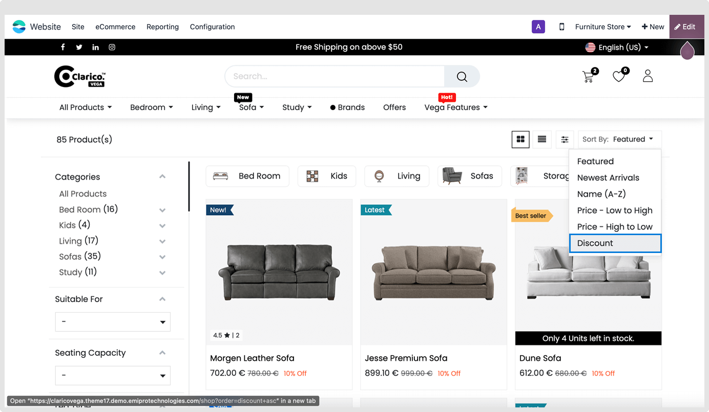
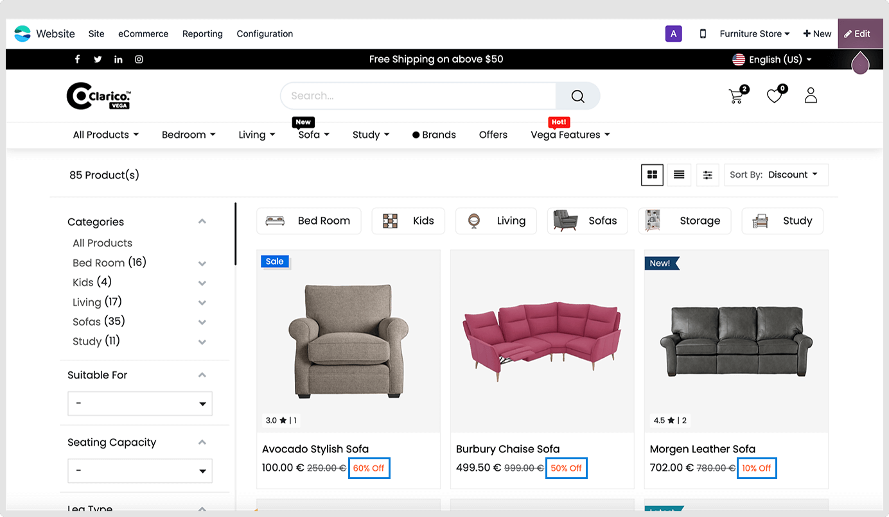

### Sort by Discount

"Sort by discount" refers to a feature on that allows users to arrange and display a list of products based on the extent of discounts applied to them. When users choose the "Sort by discount" option, the products are arranged in descending order, with those offering the highest percentage or monetary discounts appearing first.

Before applying the filter

After applying the filter
