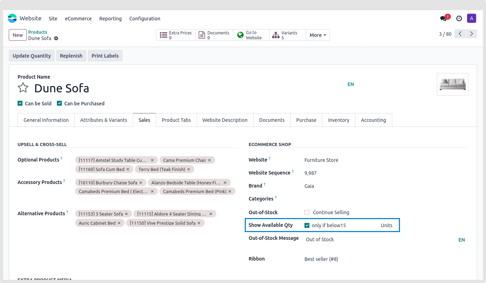
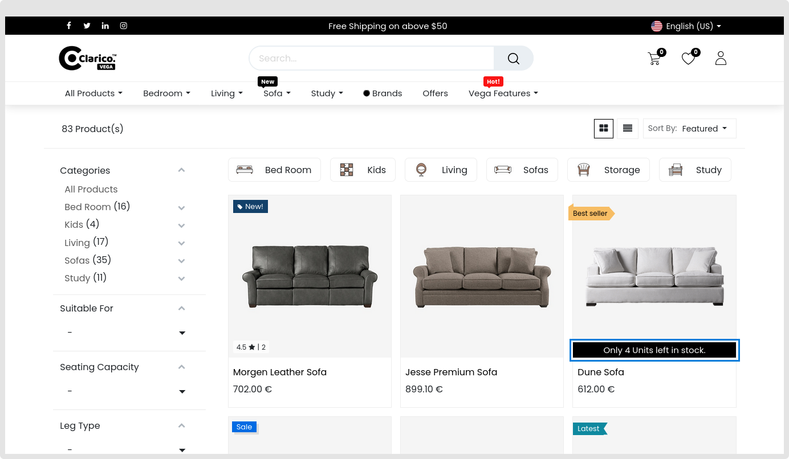

### Stock Indicator

The "Stock Indicator" feature provides valuable insights into product availability for enhanced transparency on your shop page. By enabling the **Show Available Qty** option for a specific product, this functionality becomes activated, offering a dynamic representation of stock information.

* Enabling Stock Indicator:

* **step 1:** Enable the "Show Available Qty" option, as depicted in the screenshot below.

* Threshold Notification:

* Once the product quantity falls below the threshold value that you have configured, a notification message will be displayed on the shop page. This ensures timely communication with customers about low stock levels and prompts them to take action.

This feature is designed to optimize the customer experience, allowing them to make informed decisions based on real-time stock information. It serves as a proactive tool for managing inventory and maintaining customer satisfaction.

