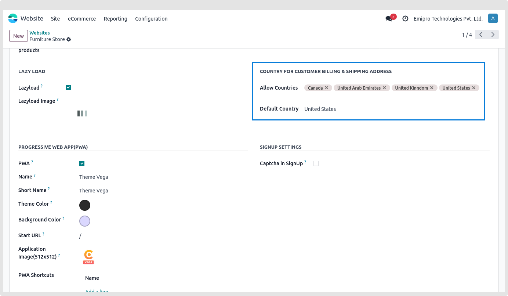
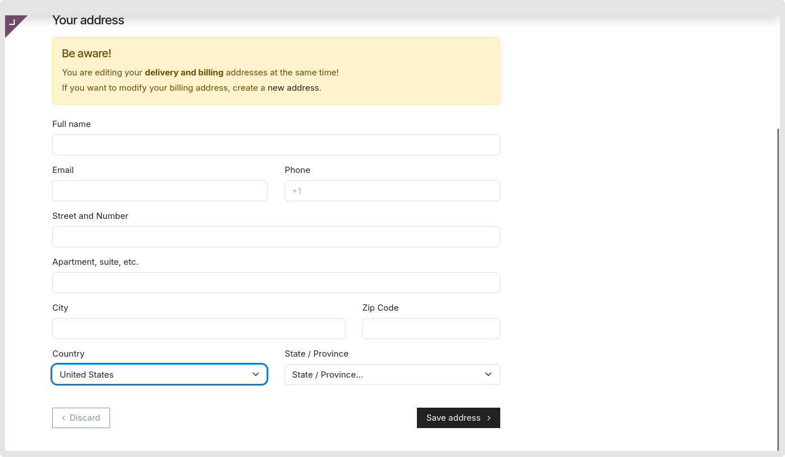

### Allow selected countries for order checkout

* Permit orders from a certain nation group solely in accordance with your company demands.

**Configurations**

1. Goto Website -> Configuration -> Websites -> select website -> Click on Theme Clarico Vega tab  under COUNTRY FOR CUSTOMER BILLING & SHIPPING ADDRESS.
2. Default Country: The country selection pop-up, which is also the default country, allows the user to pick the default nation.
3. Allow Countries: Select the countries you would like to show in dropdown.

