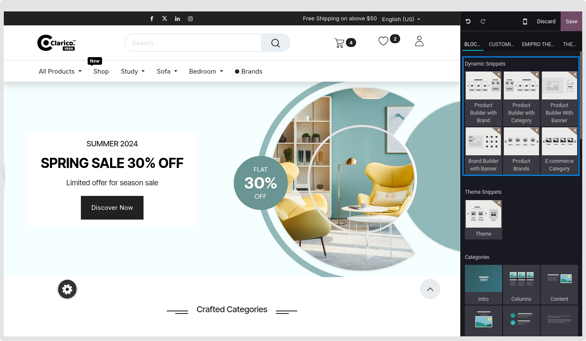
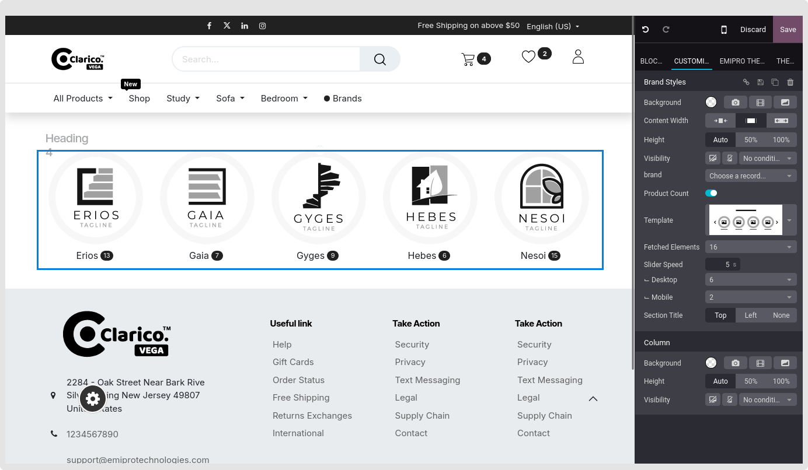

### Brand Builder

* With this dynamic snippet, you can highlight the brands.

**Configurations**

1. Navigate to the webpage where you wish to adjust the slider in order to set Brand Builder. Select the "Edit" button located at the upper right corner and remove the Brand snippet from the Dynamic Content area as seen in the figure below.

2.After dropping the snippet, the various options will appear below.

Visibility: This sample can be hidden for desktop or mobile viewing, depending on the circumstances. 
Brand:  Select the brand name using the search function. The brand you choose will appear above this selection. You can then delete the brand from there. 
Template: You may choose from a variety of snippet styles. 
Fetched Elements: the records you intended to display. 
Slider Speed: Adjust the slider's speed.

{:.alert-warning} 
> 
> #### NOTE
> 
> **It will show the Max 16 brand in the slider by default.**
> 

