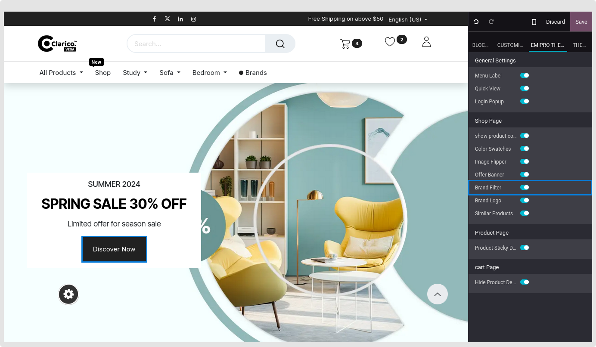
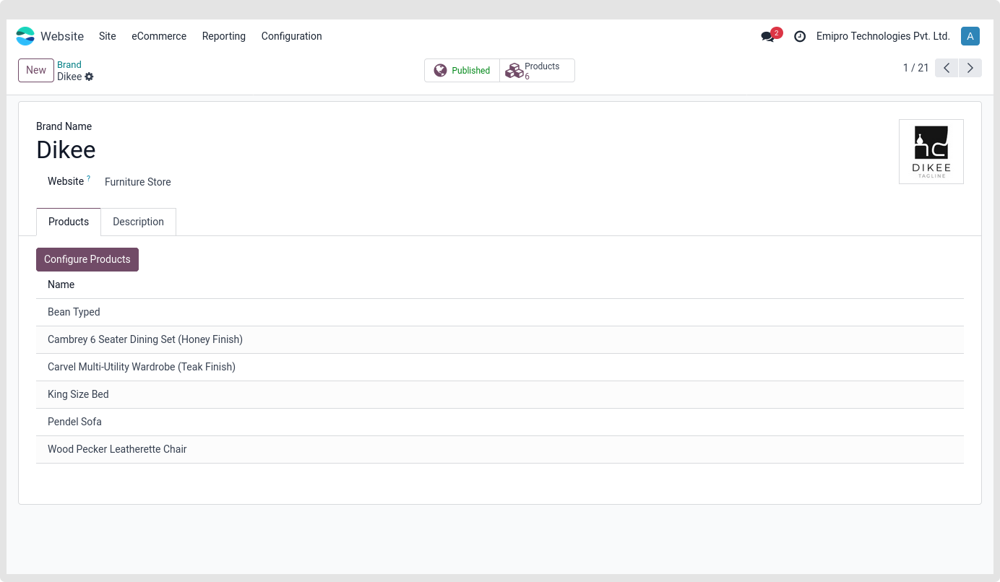
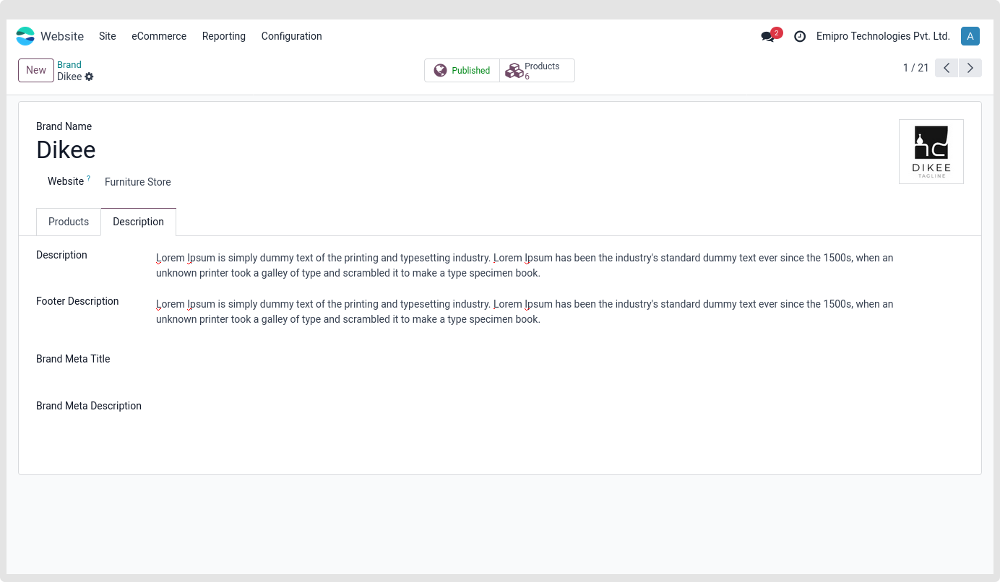
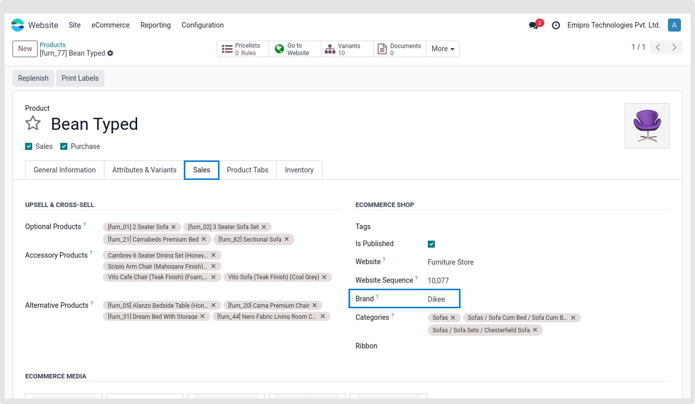
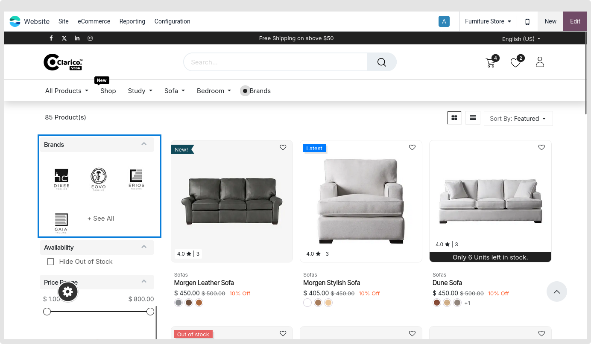
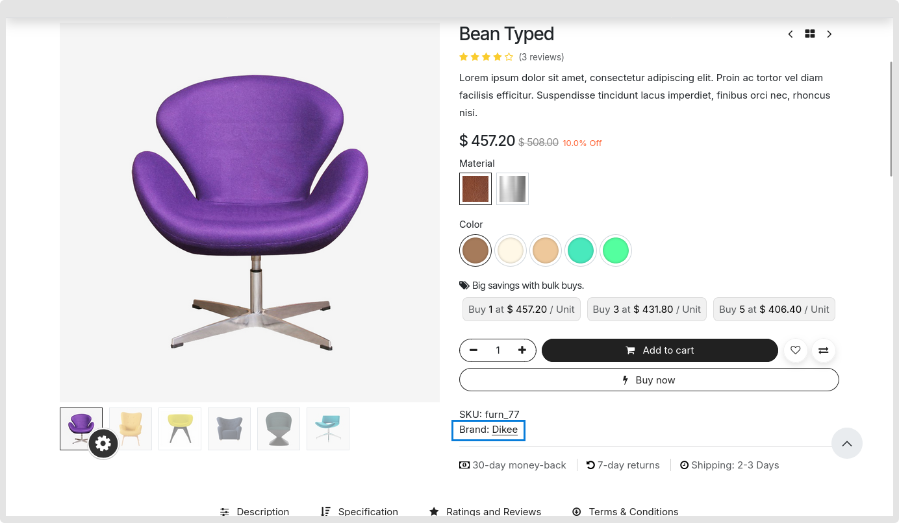

### Product Brand

Open Website Editor from the website and choose Clarico Vega to activate Product Brand. The Product Brand option is available, as seen in the screenshot below. Save the modifications and enable that option.

Navigate to **Website / eCommerce / Products / Product Brands** on the admin side. As seen in the picture below, you are able to allocate items and customise brand information.

As shown in the screenshot, Fill up the details of your brand and it will be preferable to upload the logo size 130 X 130px. Also, don’t forget to publish the brand. After creating a brand, go to the product view and assign it to the product. Save the changes

Open the product in the admin backend view and assign the brand as indicated in the image below to setup the brand in the product record.

 

 

Shop page with brands filter after attribute listing.

 

 

