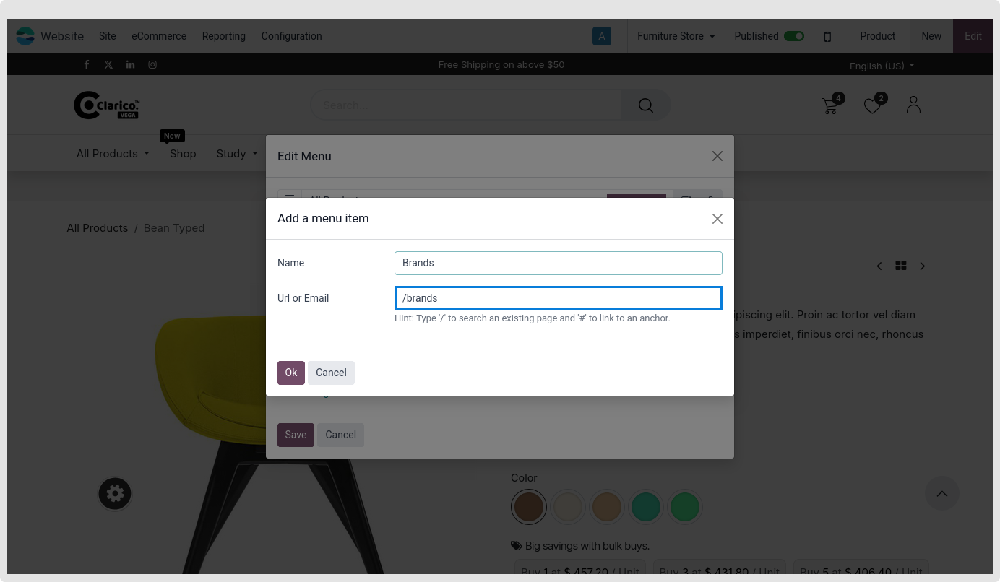
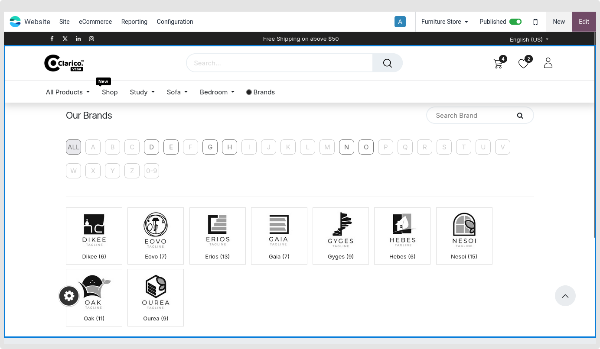
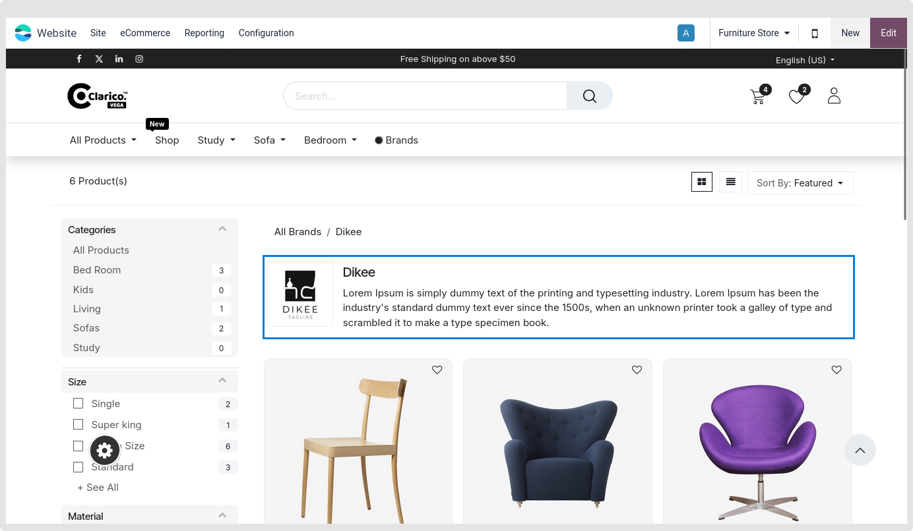

### Product Brands Listing Page

Customers may view all published brand listings along with their names on the Brand listing page. Customers may notice the alphabetical easy navigation at the top of the website. To navigate the end user, you must first establish a new menu for the Brand listing page redirection. To direct users to the Brand Listing page, create a new menu from the website and give the /brands URL as seen in the picture below.

* As shown in the picture below, you will be sent straight to the Brand Listing page when you select the "Brands" menu item. where all of the highlighted brands are displayed at the top, followed by an alphabetical listing of all the brands.

* Setting up the featured brand portion's display brand configuration: Enable the Featured Brand feature by opening that brand record in the backend. To display on the brand page, you may add a brand log and brand content.

 

