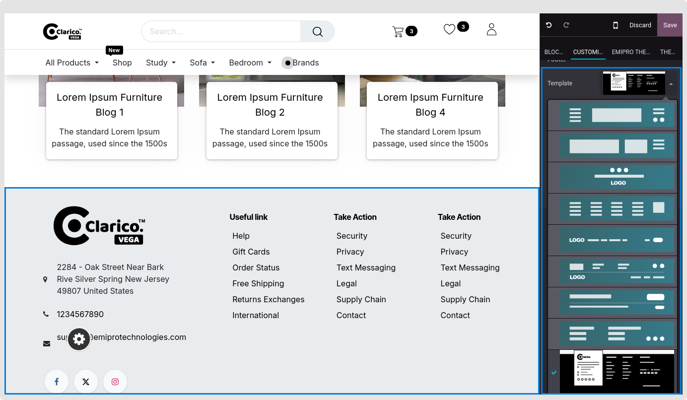

### Change Footer Style

* Goto Website -> Editor ->  Edit -> click on the footersection as below. Choose the footer, from the dropdown menu with the available footer options. Select the appropriate theme footer and save the changes.

