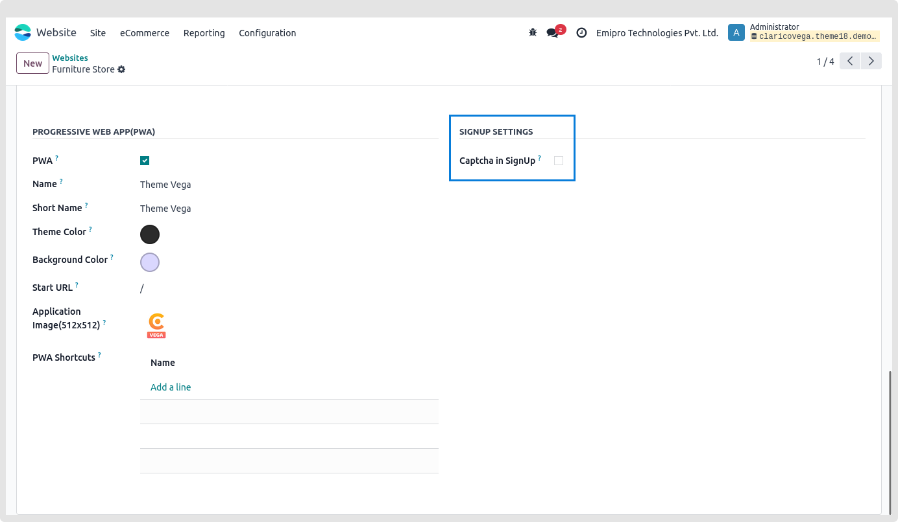

### Google Recaptcha in sign-up

* We wanted to bring to your attention a crucial security feature that will help safeguard your website from potential threats. We have implemented Google reCAPTCHA for the sign-up process to mitigate the risk of automated scripts creating unauthorized accounts, which could potentially impact your website's performance.

To enable this security feature, please follow these simple steps

**Step: 1** Go to Odoo Backend (Enable the developer mode from Setting -> General Settings -> Scroll down until Developer Tools and click on Activate the developer mode, So by clicking on it it will enable that mode).
**Step: 2** Website -> Configuration -> Websites -> Select the website
**Step: 3** Select the **Theme Clarico Vega** tab
**Step: 4** Enable the option for "Captcha in SignUp" as shown in the image below

* Ensure you configure the appropriate site key and secret key values in the settings to seamlessly implement this feature.

* By incorporating Google reCAPTCHA, you add an extra layer of protection to your website, ensuring a smooth and secure sign-up experience for your users.

