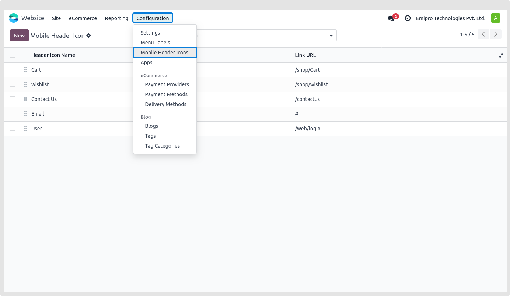

### Change Header Style

Goto Website -> Editor ->  Edit -> click on the Header as below.

 

* Configure the header options and save on click.

 

{:.alert-warning} 
> 
> #### NOTE
> 
> To edit any icon, such as the Search, Wishlist, Shopping Cart, or User icon, if you are using Custom Header Style number 1, you must take the following actions:
> 
> 
> * Go to theme_clarico_vega/static/src/img/header_icons inside the theme folder
> * All of the previously stated icon images are available
> * Replace with a fresh picture of the same dimensions
> * After the server has restarted, examine the header behavior
> 
> 
> 

 

* Configure the mobile menu for style 1

* 1. Go to odoo backend **Website -> Mobile Header Icon -> Click on New**

* 2. Add the name, URL, and picture (which needs to be an svg).
* 3. Drag and drop the records above and below on the listing page to alter the order.

