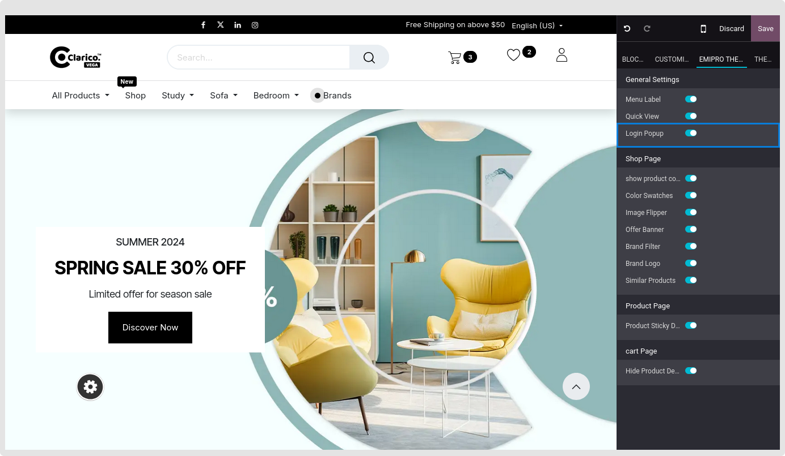
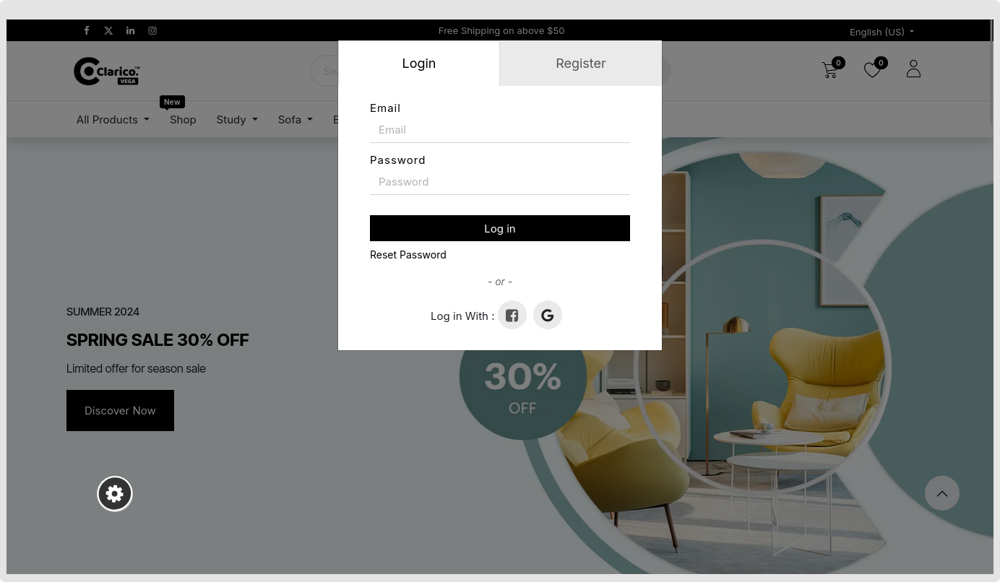

### Log in & Sign up Popup

The consumer may rapidly register and log in thanks to this functionality. They are not required to look through the Register / Login page. Customers may input their login, password, registration link, password reset, and authentication provider all in one pop-up window. They are therefore spared from having to go through every page for certain tasks.

Goto Website -> Editor ->  Edit -> Click on Emipro Theme Tab -> General Settings -> enable/disable Login Popup and Save button. 

