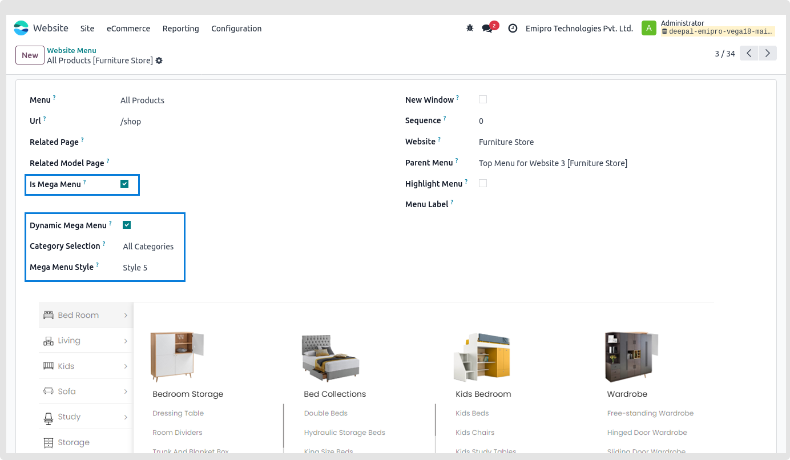
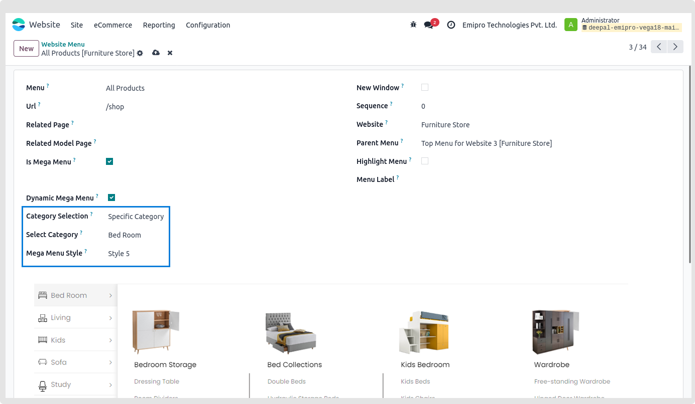
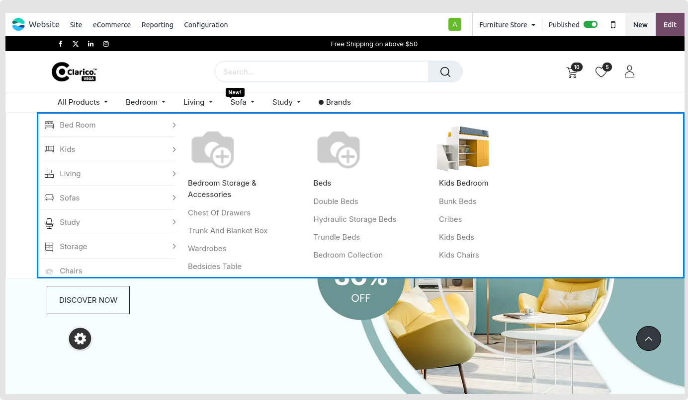
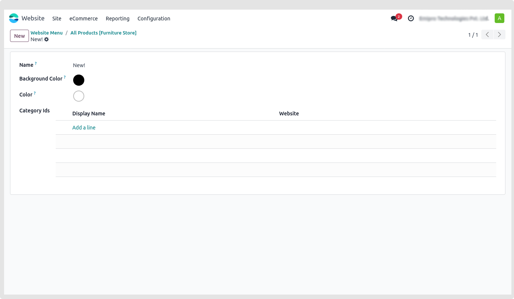
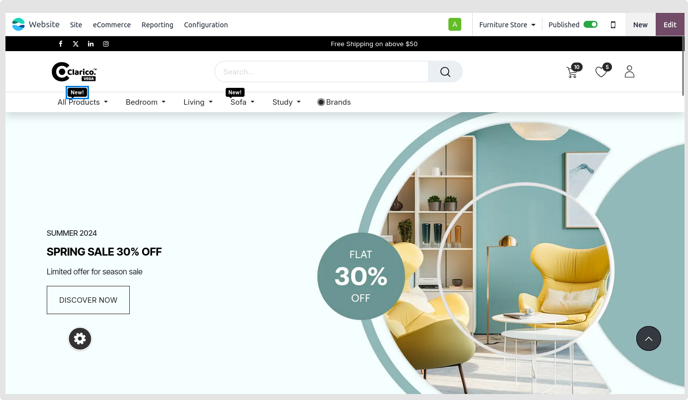

### Dynamic Mega Menu

Use six attractive designs to display the eCommerce category in the mega menu.

* **Step 1:** Go to Odoo Backend (Enable the developer mode from Setting -> General Settings -> Scroll down until Developer Tools and click on Activate the developer mode, So by clicking on it it will enable that mode).
* **Step 2:** Navigate to Website -> Configuration -> Menus > Create new menu.
* **Step 3:** Click on Dynamic mega menu options that appears after checking this box. Upon choosing this option, the remaining fields will become active.

#### 1. Category Selection:
You can either set **Every category** or **specific category** (the specific category option is set by default)

#### 2. Select Category:
Select Specific category under Category Selection. Choose a category now for that specific dynamic mega menu.

#### 3. Mega menu Style:
You may choose any one of the six styles based on your preferences. 

You may view the outcome on the website after saving the menu.

{:.alert-warning}
>#### Note
> **Dynamic mega menu functionality will be compatible with on hover option.**
>

#### Category Menu Labels

 - You may use this functionality to show the menu label for a certain category or menu
 - Navigate to **Websites -> Configuration -> Menu Labels** in the Admin panel to activate the Menu label feature.

* **Step 1:** Create a new Menu Label

* **Step 2:** Navigate to Website -> Configuration -> eCommerce categories -> Choose any category to add a menu label to. The **menu label** field to choose from the list of potential menu labels is shown.

* **Step 3:** By inputting the label's name and selecting **create and edit,** you can also create a new menu label from the eCommerce category.

* **Step 4:** Based on the requirements, choose the background and text colours of the constructed menu label.

* **Step 5:** The website's menu labels for the categories listed below will be visible.

