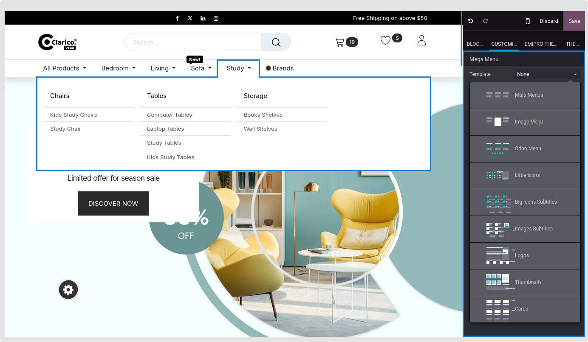
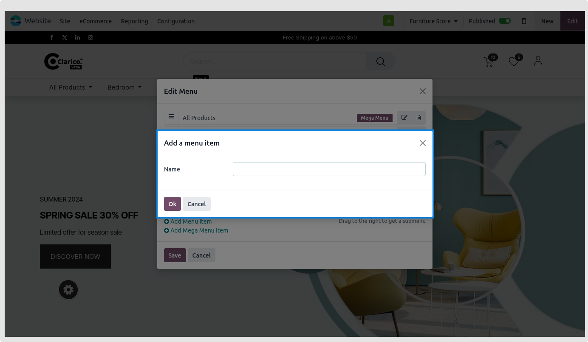
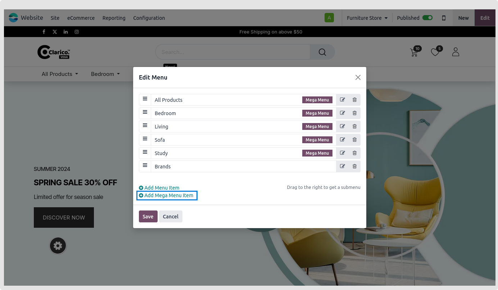
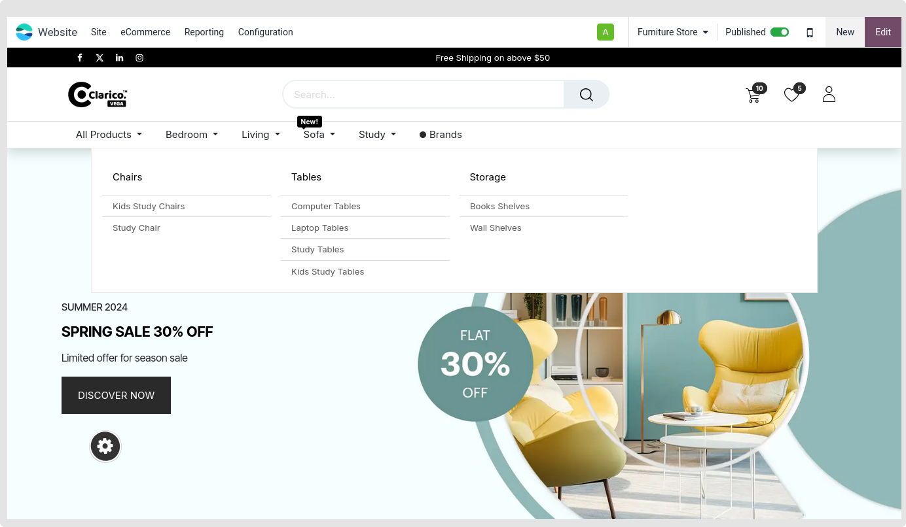

### Mega Menu

**Goto Website -> Site ->  Menu Editor**  then select **Add Mega Menu Item** to build a mega menu. To construct a mega menu record, it will display a popup.

 

 

 

Set the mega menu style:

* **Step 1:** Open the Website Editor by visiting the page and clicking the edit icon.
* **Step 2:** Select the mega menu from which you wish to alter the appearance.
* **Step 3:** As seen in the picture above, check the snippets list located on the left side of the website. Six snippets are given to modify the menu styles.
* **Step 4:** Drag the desired snippet into the menu and undo the previous style that you had set.

