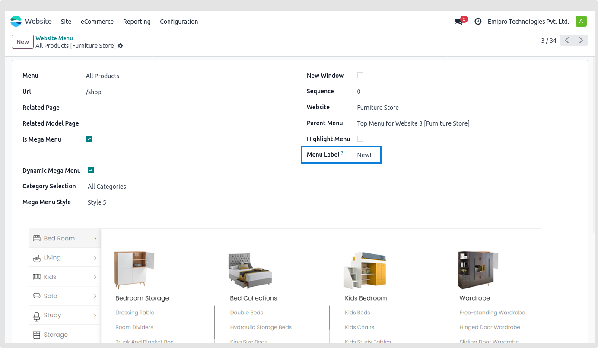
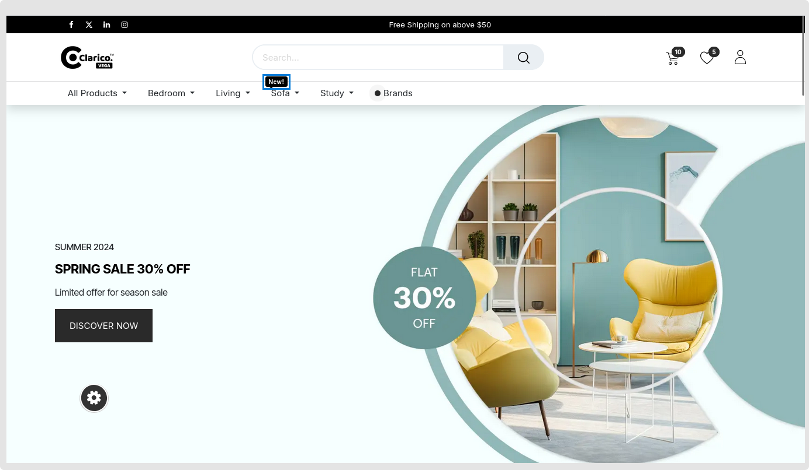

### Menu Label

* Show menu label in right or top using this functionality. Additionally to changing the menu label's colour, you may add the label's display text.

* Go to **Website -> Configuration -> Menus -> Select Menu -> Menu labels** 

How to set up menu labels:

* **Step 1:** Choose the menu that you like the menu label to appear on. Set background color and text color and save then menu.

{:.alert-info} 
> 
> #### TIP
> 
> You can assign menu label and colour at the time of menu creation or later on from the website editor panel. 
> 
> 
> 

 

