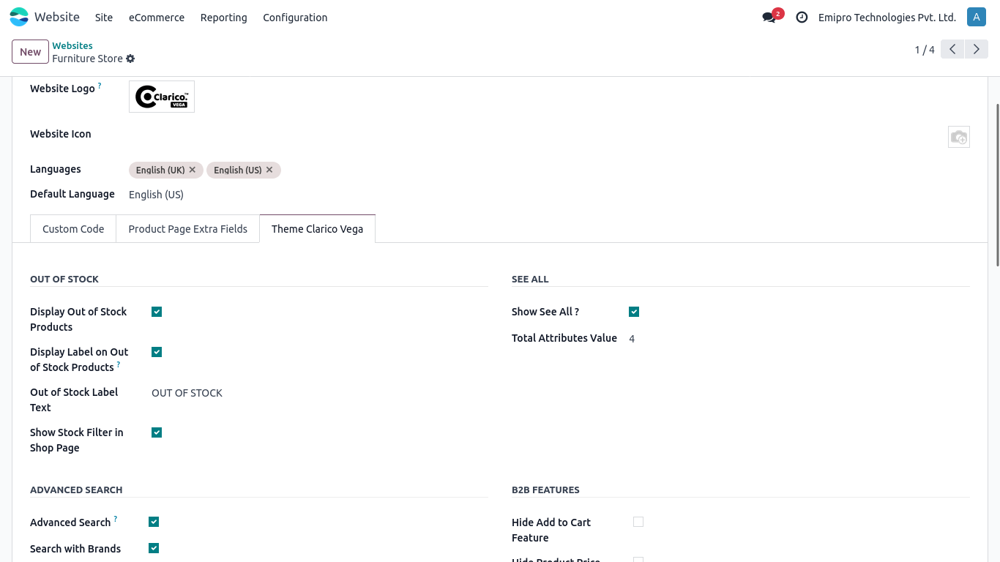
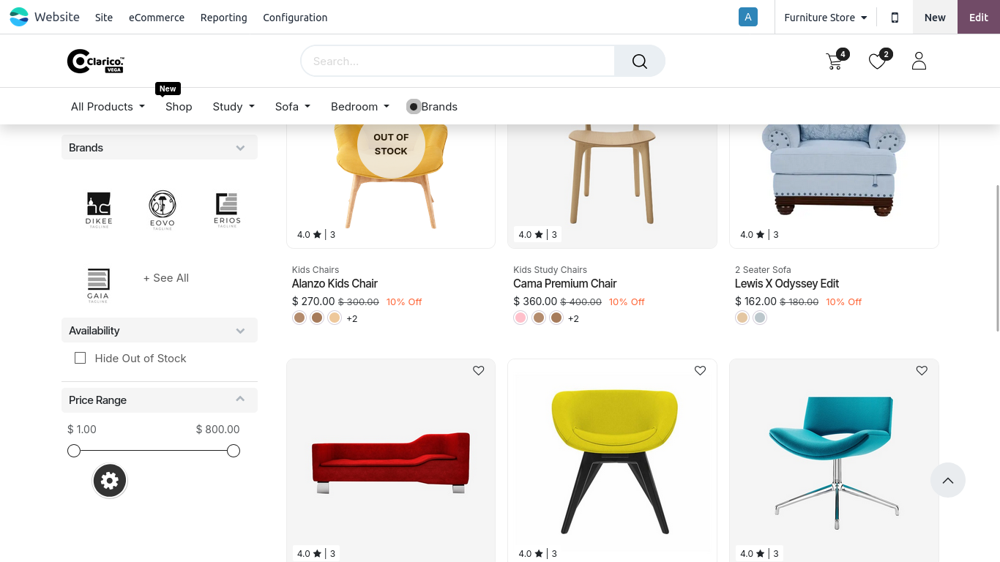

### Out Of Stock

* Users may deactivate out-of-stock goods from the Dynamic Product Snippet, Search result, Shop page, Suggested Accessories, Available Options, and Alternative goods by using the Out of stock functionality.

**Configurations**

**Display Out of Stock Products**

1. Go to Website -> Configuration -> Websites -> Select theme -> Theme Clarico Vega Tab -> Out of Stock section and check the Show Stock Filter in Shop Page, then check the shop page.

**Show Stock Filter on Shop Page**

1. Select any website by going to Website App -> Configurations -> Websites, then click on the Theme Clarico Vega Tab and then select Show Stock Filter on the Shop Page section.
2. The Availability filter will be shown on the store page if you choose the option Show Stock Filter on store Page.

