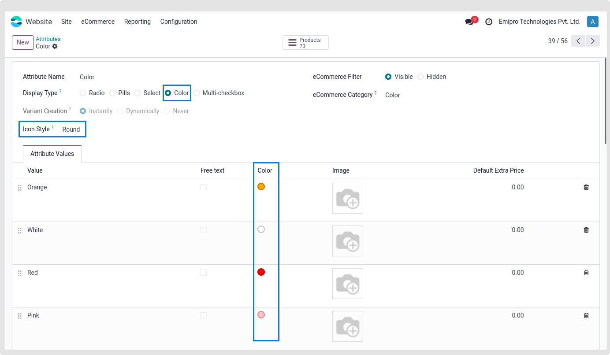

### Attribute Swatches with Tooltip

* Swatches are the feature that allows for presenting product options by displaying the corresponding visual representation inside the Attribute Listing itself. They grab the customers’ attention and shape their decision-making behaviors.
* **Configuration of Swatches:** From the Backend, choose Attributes and open the appropriate attribute record to setup the Swatches. Upload the icon picture as seen in the screenshot below, then save the modifications.

{:.alert-warning} 
> 
> #### NOTE
> 
> 1. To see the swatches, the attribute display type must be set to Color.
> 2. Additionally, you may modify the icon/swatches look using the same setup as the screenshot above.
> 3. To see how this functionality is being used in real time, please click this link: Avocado Stylish Sofa
> 
> 
> 

 

