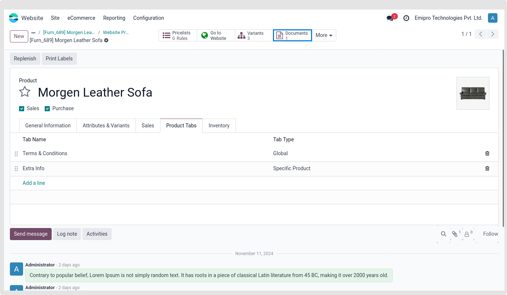
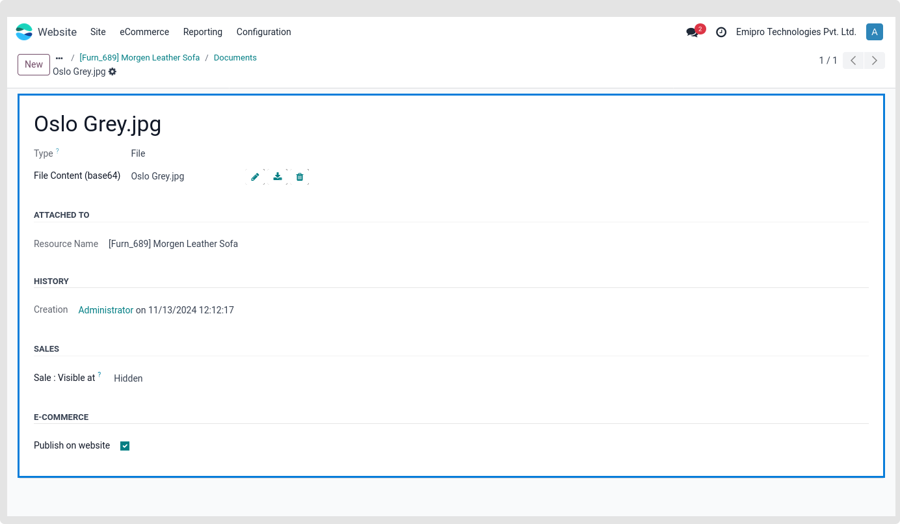
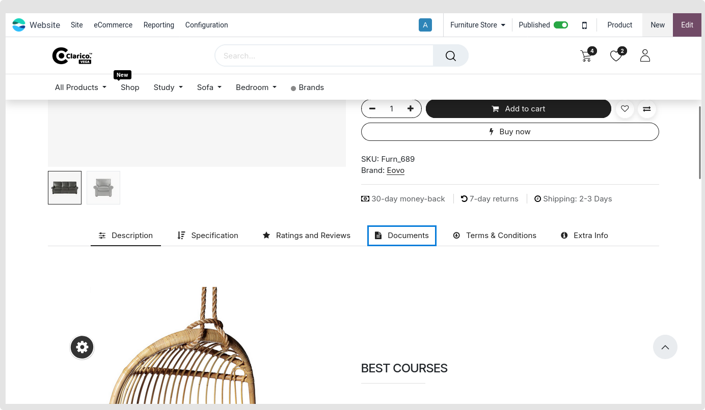

### Documentation Tab

The administrator may upload several documents, such as a user manual or terms and conditions, in the format of their choice, and link them to every product on the planet.

You may provide your consumer with the following functionalities on the Product page by using this feature:

1. Customers can download any type of document
2. Customers can click on any link, internal or external

* **Step 1:** To see the document list, navigate to Websites > Products > Documents, as seen in the illustration below. From that angle, you may begin a new document by uploading a file or a URL.

* **Step 2:**  Set the document/Image and tick Publish on website option. If this option Publish on website is not ticked then document will not display in website.

