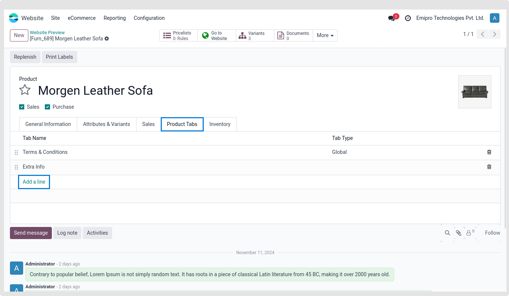
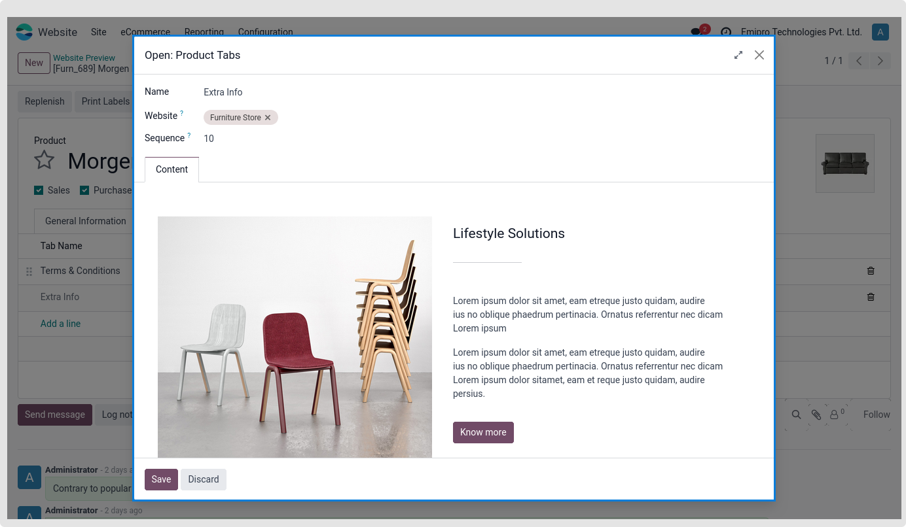
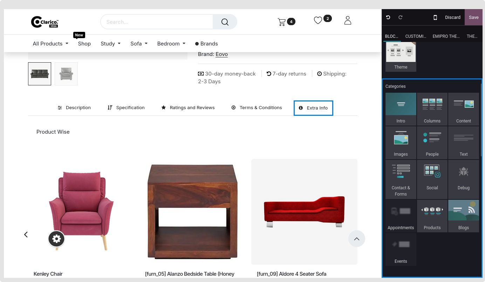
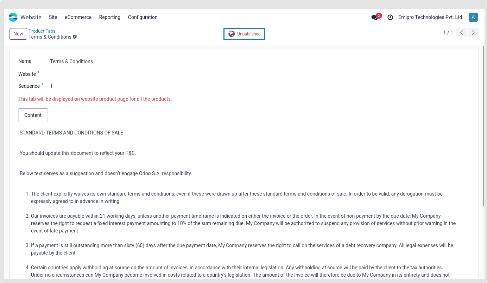
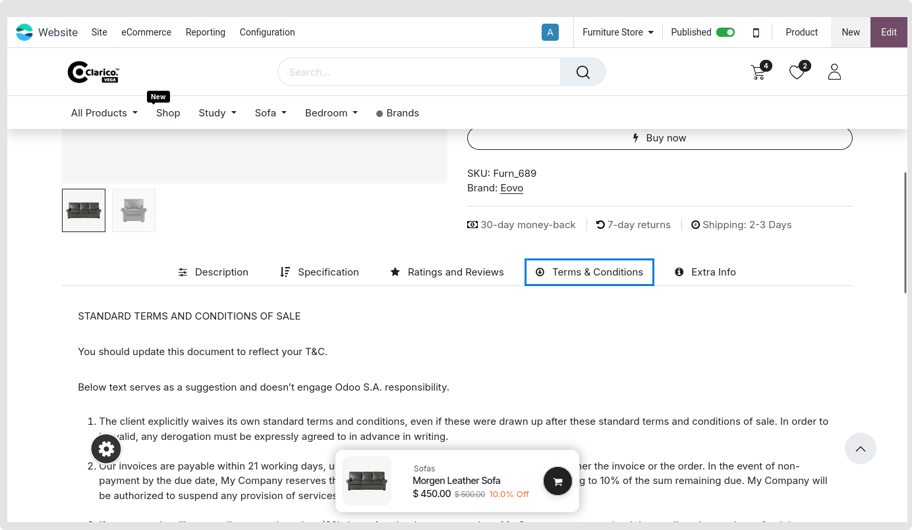
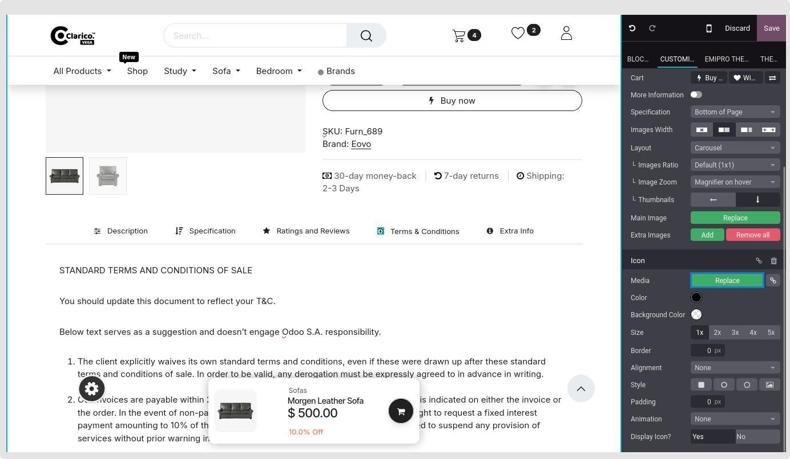
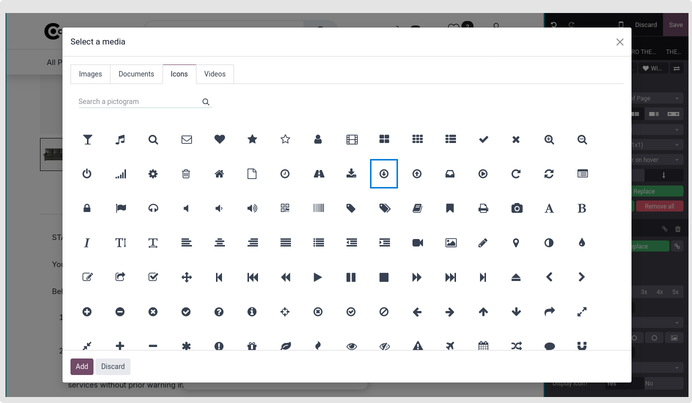
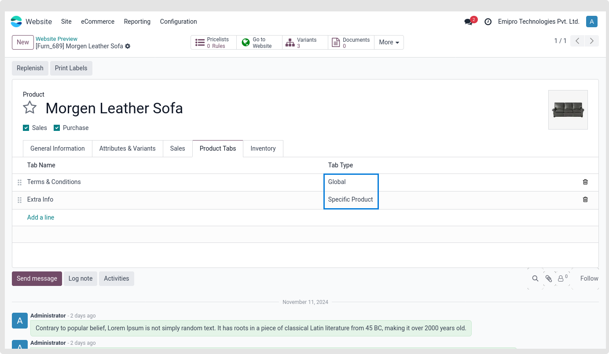
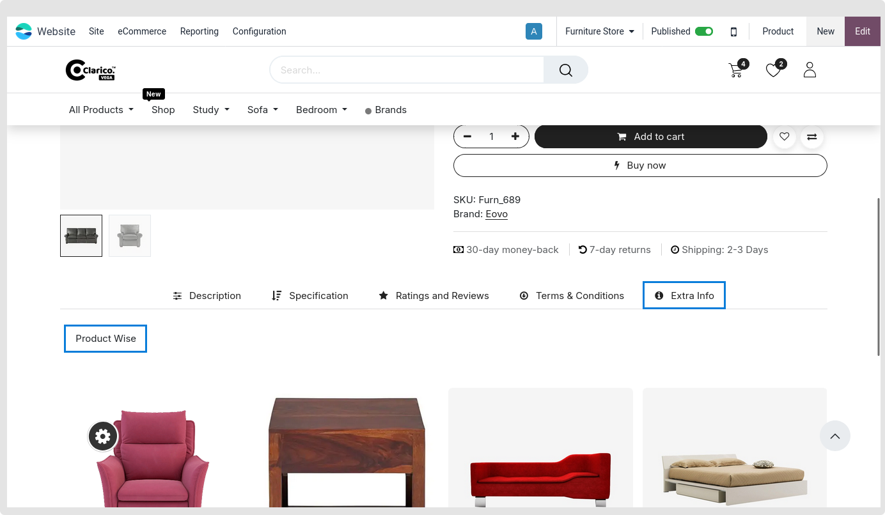

### Dynamic Product Tabs

This feature allows you to set up more than one tab on a product page. It is possible to display smart product tabs by carefully designing a product tab section.

Tabs can be configured in two ways
1. Product Specific
2. Global tabs

#### 1. Product Specific

Steps to configure Product Specific tabs:

* **Step 1:** Go to the Product backend of a particular product where you want to add the extra tab.

* **Step 2:** Navigate to the Product tab and choose Edit. There is a link to Add. A window called "Create Product Tabs" will show up when you click on the Add link. Name the tab and indicate the content. You can drag and drop front-end snippets and add HTML material from the back end into the content area.

{:.alert-warning}
>#### Note
> A website will be shown on every website where the theme is installed if it is not selected while establishing a tab.permissions to the editor; no guests nor portal users will be able to see it.
>

#### 2. Global Tabs

Steps to configure Dynamic global product tabs:

* **Step 1:** Go to the Website -> eCommerce -> Products -> Product tabs
* **Step 2:** Create a Product Tab. Specify the Tab name and Content. In content, you can add Html content from the back-end or you can drag snippets from the front-end as well.

{:.alert-warning}
>#### Note
> - A website will be shown on every website where the theme is installed if it is not selected while establishing a tab.
> - Once a tab has been configured on your end, it may be published. If it is not published, neither guests nor portal users will be able to see it; only admin users with editing access will be able to see it.
>

* **Step 3:** Publish a tab after set up properly

* **Step 4:** The front-end allows you to modify the icon for a certain tab, which is then applied to all product pages worldwide.

To pick the suitable icon for that specific product tab, click on the symbol and Select Media from the Editor.

#### 3. GLOBAL TAB PRODUCT SPECIFIC

How to set up a global tab that is product-specific:

* **Step 1:** Adhere to the Global Tabs instructions exactly.
* **Step 2:** To add the global tab product specific tab, navigate to the product backend of that specific product.

* **Step 3:** Add or change text as needed.

