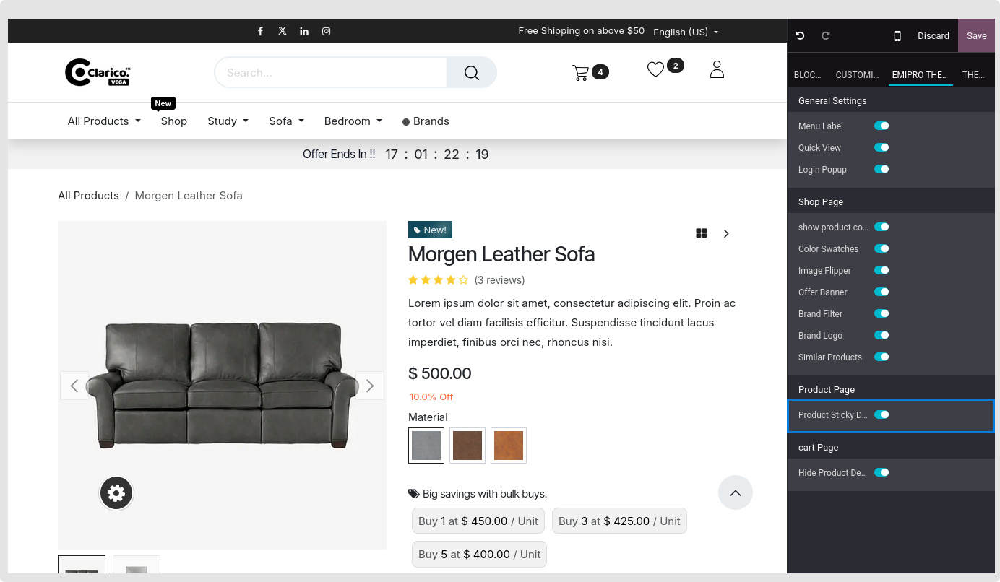
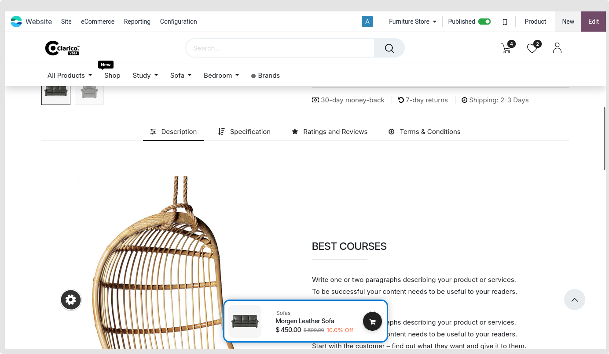

### Sticky Product Details

This feature places the **Add to Cart** button and the **Buy Now** option at the bottom of the page together with product data like the image and price. Customers can improve the effectiveness of the cart to the products with this functionality.

  

Open Website Editor from the website and choose the **Clarico Vega** option to enable Sticky Product Details. The Sticky Product Details option is available, as seen in the screenshot below. Save the modifications and enable that option.

 

