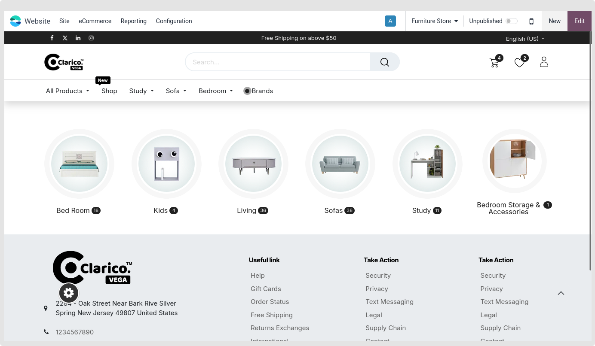
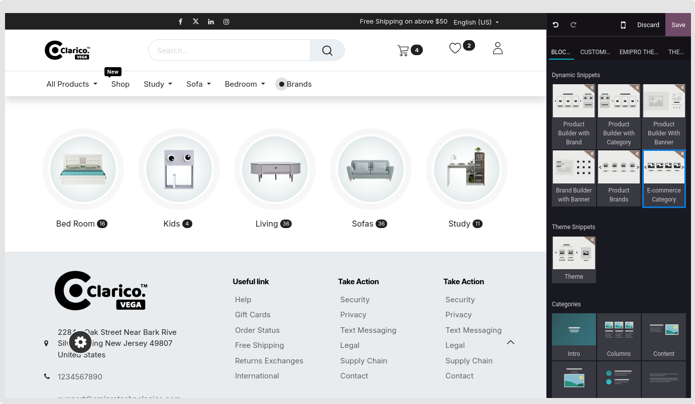
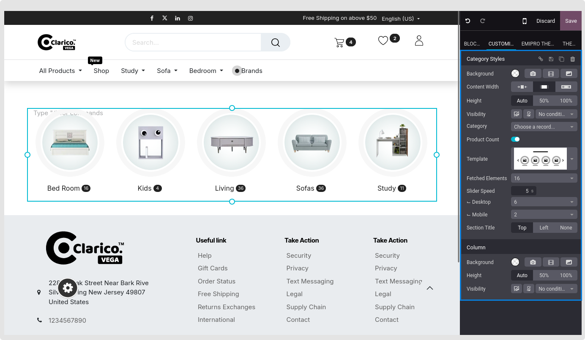

### eCommerce Category

Display selected category into your website

**Step: 1** Go to website -> Editor -> Edit
**Step: 2** Click on Block Tab -> Under Dynamic Snippets option, drag and drop eCommerce category snippet

**Step: 3** Select category you want to show
**Step: 4** Select the product count option if you would like to show the number of product associated with that category
**Step: 5** Change other options based on your need and also change the category style from template

