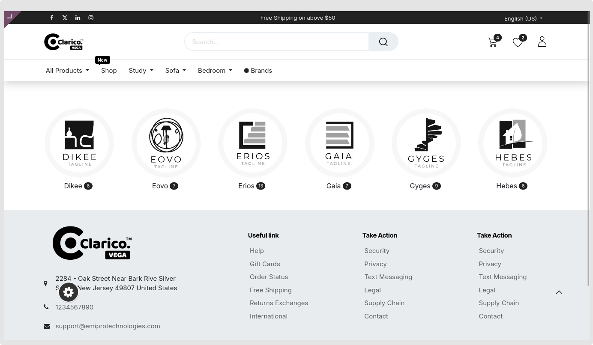
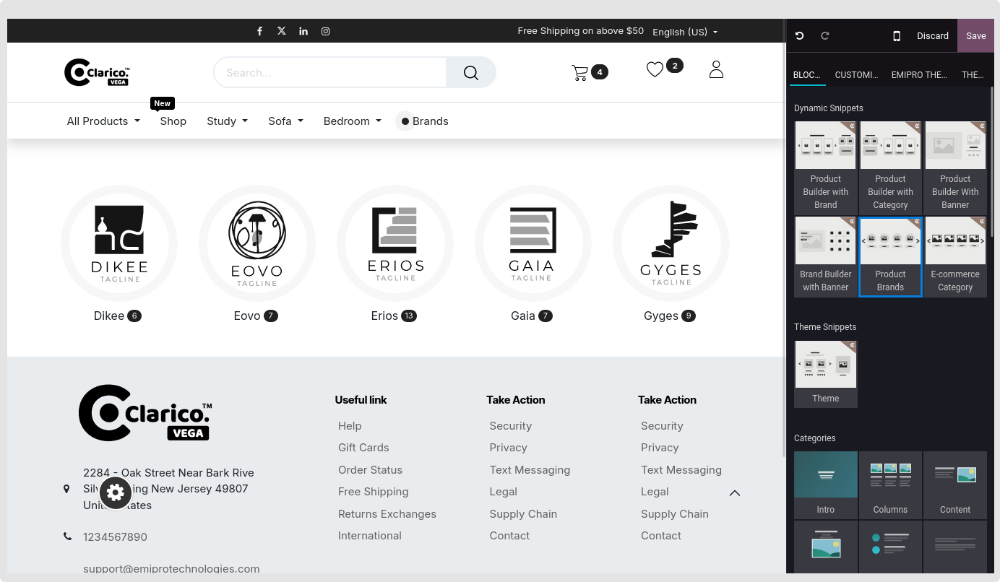
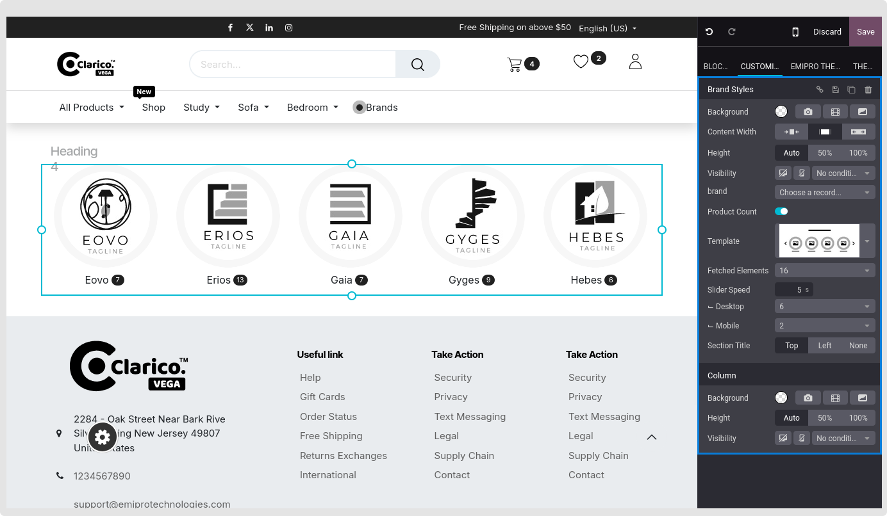

### Product Brands

Good ecommerce branding is about building trust with customers. Use this slider to show top brands

**Step: 1** Go to website -> Editor -> Edit
**Step: 2** Click on Block Tab -> Under Dynamic Snippets option, drag and drop Product Brands snippet

**Step: 3** Select the brand you want to show
**Step: 4** Select the product count option if you would like to show the number of product associated with that brand
**Step: 5** Change other options based on your needs, and also change the brand style from template

