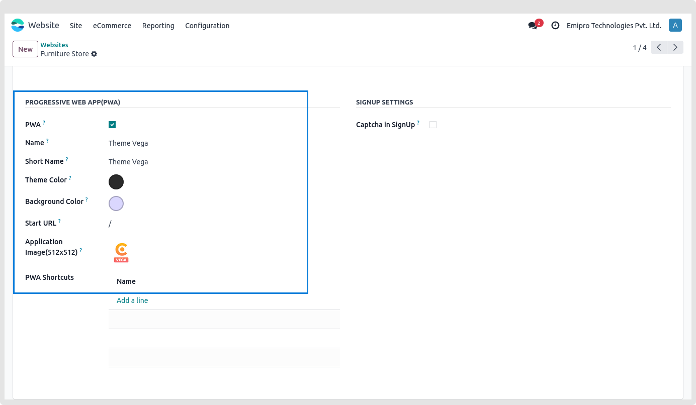

### Progressive Web App (PWA)

Web technologies are used to create Progressive Web Apps (PWAs), which have functionality and a user experience similar to native apps. With the use of contemporary APIs, it is constructed and improved to provide native-like features, dependability, and installability while using a single codebase to reach anybody, anywhere, on any device.

### **Configurations**

We must set up a few things in the Odoo for your website to function as native applications using PWA. Select any website and proceed to the PWA area by navigating to **Website / Configurations / websites / Theme Clarico vega** tab. You'll encounter a variety of fields.

* PWA: To prepare your Odoo website to function like a native app, enable the checkbox.
* Name: Choose a fitting name for your native application, which will appear on the splash screen and the "Add To Home Screen" dialogue box.
* Theme Color: The color you choose here will alter how the browser or programme appears.
* Background Color: the color applied to the splash screen when it is launched from an application shortcut or the home screen.
* Start URL: When a user adds an app to their home screen and clicks on it, they will be sent to this URL.
* Application Image (Must be 512x512 Width & Height): It will be included into splash screen, home screen, and app launcher icons.

 

## **Add To Home**

## **Add To Home Pop-Up**

## **PWA like Native App**

## **Mobile View Splash Screen**

## **Offline View**

## **Desktop View Install App Pop-Up**

## **Desktop View Offline**

* PWA works only on HTTPS environments. It does not support traditional HTTP.
* PWA is compatible with Chromium-based Web Browsers only. It runs best on Google Chrome (v49 and above), Microsoft Edge, and Opera. Make sure, your web-browser should be latest and keep updating regularly to fully support the PWA that you create.
* Safari and Mozilla Firefox do not support the PWA (at the time of writing this guide).
* If you want to check whether your Web-Browser is compatible with PWA, visit https://whatwebcando.today/ (Go to this section => App Lifecycle => Home Screen Installation if it's Yes then your browser PWA compatible).
* For iOS device PWA compatibility, users need to create separate images for the app Splash Screen. Reference Site - https://appsco.pe/developer/splash-screens. Once you create the splashcreen, you need to just replace those Images with existing one from the theme module at this given path: theme\_clarico\_vega/static/src/img/splashscreens.
* Multi-Language is not supported (at the time of writing this guide).
* If your Internet is off/not working, PWA will not work flawlessly. Only cached data can be accessed at the same time.

