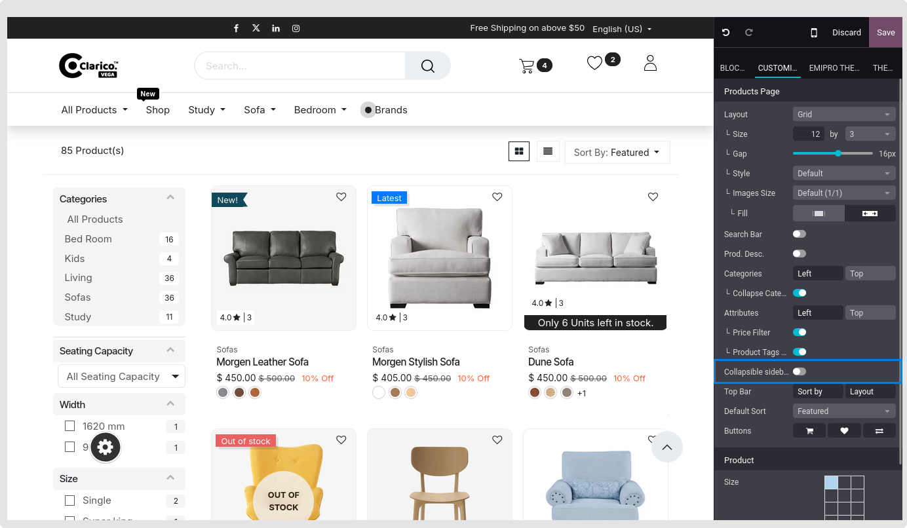

### Collapse Filter

The data that may be displayed on the page for the shop is limited by filters that can occupy a significant amount of screen real estate. When you are not changing the filters, you may lessen this by collapsing them. When you wish to make changes, you can expand them once again.

Goto Website -> Editor ->  Edit -> click on product box -> Enable Collapsible sidebar

By enabling this feature it will collapse all attribute filters on the shop page.

