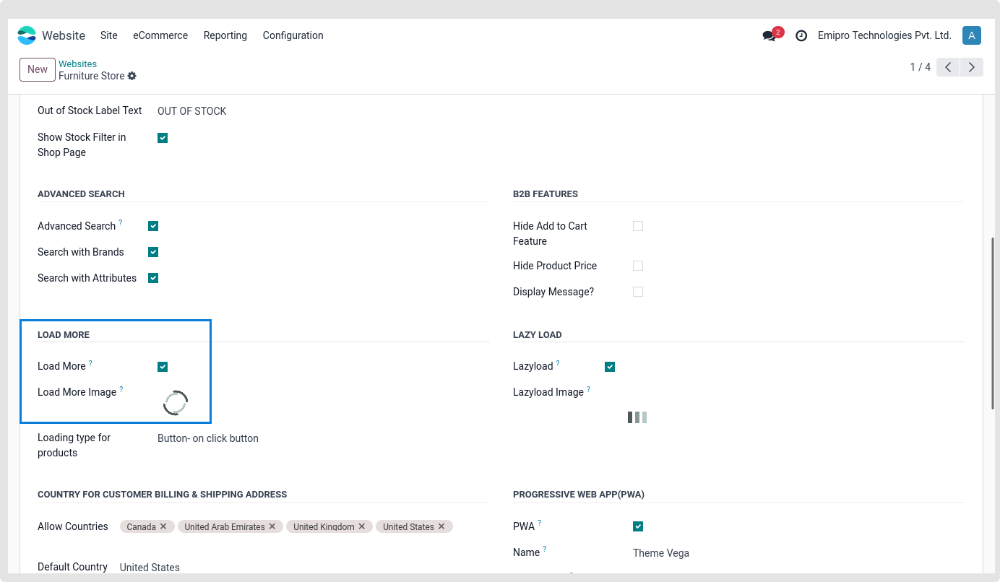

### Load More Products

Infinite Scroll / Load more is used to load more products through Ajax without refreshing the page.

Navigate to the backend, select Website / Configuration / pick Website to activate or disable the infinite scroll/load more capability. The Emipro Theme Settings page is where you can view the Load More setting, as seen in the picture below.

 

Two categories of product loading functionality exist:

1. Automatic- on page scroll
2. Button- on click button

The website allows you to set the Load More picture, which will be displayed when the Load More feature is activated.

{:.alert-info} 
> 
> #### TIP
> 
> We advise you to keep the shop page's product column and count ratio normalised. The product count should be in the multiplier of three if the product column has three entries. Using [3 x 5 = 15, 3 x 6 = 18, 3 x 8 = 24, 4 x 4 = 16, 4 x 6 = 24] as an example
> 
> 
> 

 

