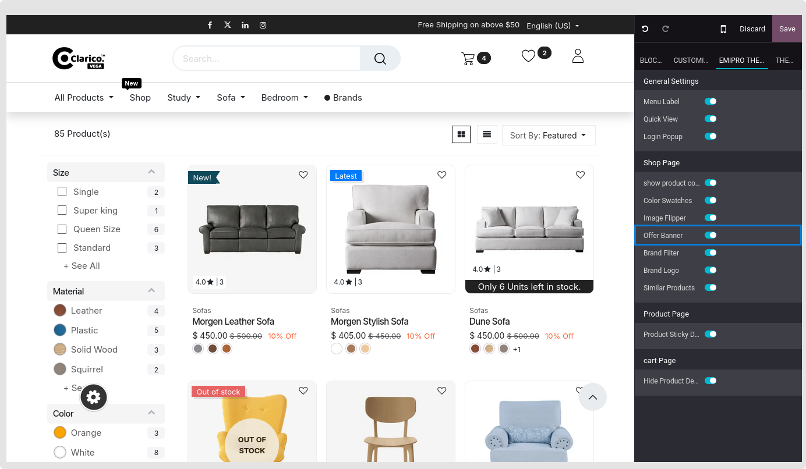
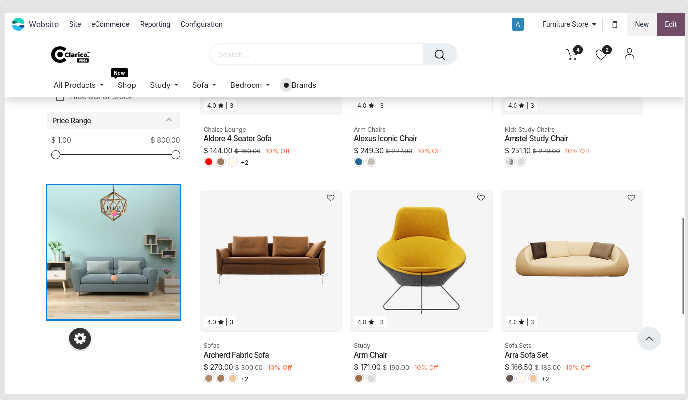

### Offer banner

Banners are used to advertise items, either new or the best-selling ones.

Open Website Editor from the website and choose Clarico Vega to activate the **Offer banner** window. The option  is available, as seen in the image below. Save the modifications and enable that option.

These choices will show up in the shop/catalog page after configuration.

