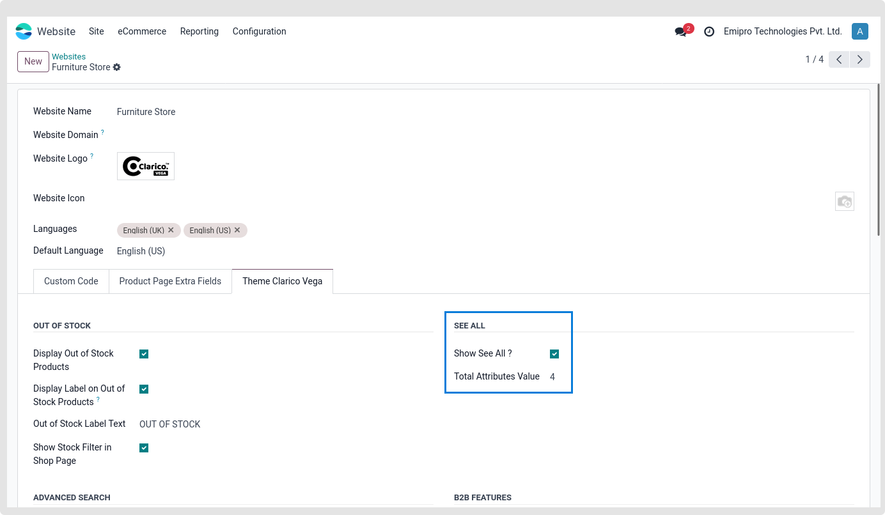
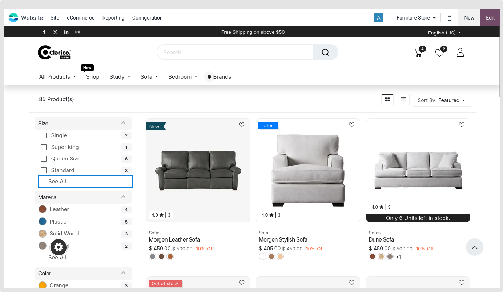

### See All

We have included a function called "See All" to improve the website store page's performance.

The product attribute filter will be filled with a maximum of five attribute values. If there are more than five attribute values, the user can examine them all by selecting the See All button.

The product attribute filter will be filled with a maximum of five attribute values. If there are more than five attribute values, the user can examine them all by selecting the See All button.

