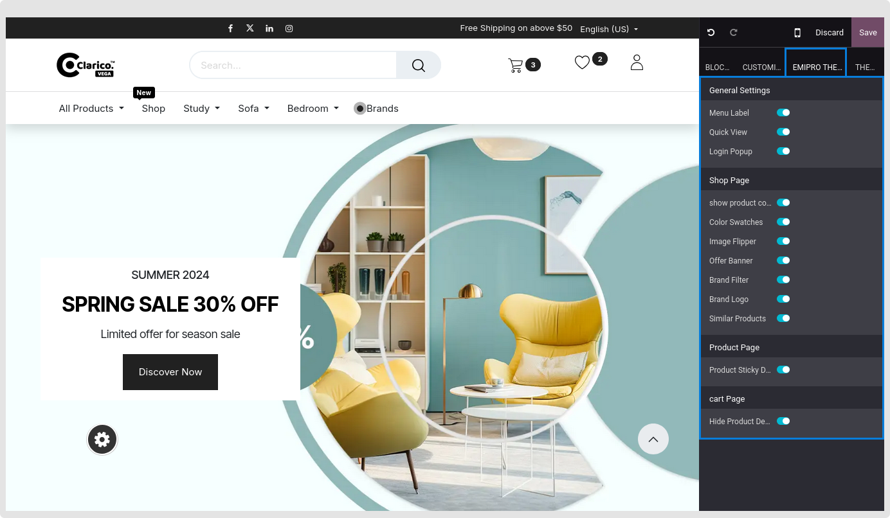

### Theme Customize

The theme customise area allows you to change the theme's fonts, colours, layout, and other options. Launch Web Editor after going to the website. where the number of tabs with different configurations is shown.

As can be seen in the image above, the Clarico Vega tab contains all of the theme feature settings.

The picture above indicates that the Option tab displays all of the basic theme choices.

